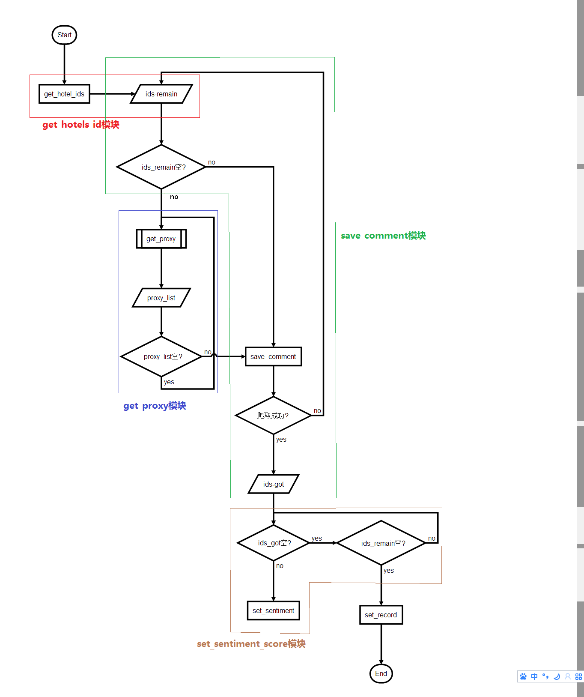

# 基本功能
爬取携程的酒店的评论，对评论多情感分析
***
# 目录结构
```.
├── hotel_ids
│   ├── ids_empty.txt   # 没有点评数据的酒店id
│   ├── ids_got.txt     # 已爬取了的酒店id
│   └── ids_total.txt   # 所有酒店id
├── log         # 日志目录，程序每次运行会在该目录生成一个日志文件
├── main.py             # 启动函数
├── README.md
├── requirements.txt    # 依赖包
└── src         # 代码目录
    ├── config.py       # 配置mongodb，日志路径等
    ├── get_hotels_id.py    # 获取酒店id
    ├── get_proxy.py        # 从[西刺](http://www.xicidaili.com/)爬取免费代理
    ├── __init__.py
    ├── save_comment.py     # 爬取点评数据
    ├── save_comment_selenium.py    # 用模拟浏览器的方式爬取
    ├── sentiment_analysis.py       # 对[snownlp](https://github.com/isnowfy/snownlp)模块的简单封装
    ├── set_record.py               # 程序结束后设置批次记录
    └── set_sentiment_score.py      # 计算每条评论的情感值
```
***
# 流程图

***
# 运行
```
python main.py
```

